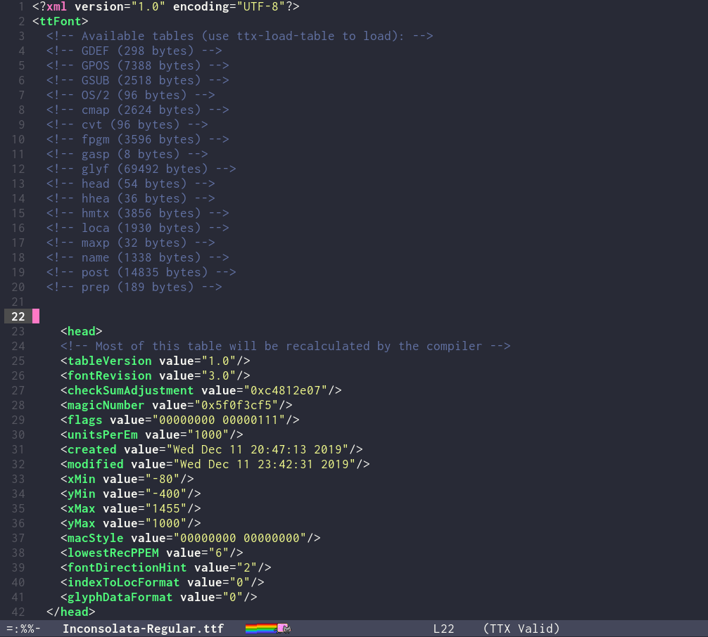

# ttx.el

`ttx.el` is an Emacs major mode for viewing TrueType and OpenType font files as
XML. It leverages the `ttx` utility from
[fonttools](https://github.com/fonttools/fonttools) to decompile font files into
a readable XML format directly within Emacs.



## Features

- **Automatic Activation**: Automatically associates with `.ttf` and `.otf` files.
- **XML Integration**: Built on top of `nxml-mode`, providing syntax highlighting and XML navigation.
- **On-Demand Table Loading**: Loads font tables individually to handle large fonts efficiently.
- **Read-only by Default**: Protects the buffer while allowing easy viewing of the font structure.

## Requirements

- [fonttools](https://github.com/fonttools/fonttools): The `ttx` command must be installed and available in your system's `PATH`.

## Installation

Add `ttx.el` to your load path and require it:

```elisp
(add-to-list 'load-path "/path/to/ttx-el")
(require 'ttx)
```

## Usage

Open any `.ttf` or `.otf` file in Emacs. `ttx.el` will automatically trigger
`ttx-mode` and display the font's available tables. By default, the `head` and
`name` tables are loaded automatically.

### Keybindings

| Key | Command            | Description                    |
|-----|--------------------|--------------------------------|
| `l` | `ttx-load-table`   | Load a table into the buffer   |
| `u` | `ttx-unload-table` | Remove a table from the buffer |

To refresh the buffer (unload all tables): `M-x revert-buffer`

## Customization

### Default Tables

Configure which tables are loaded automatically when opening a font:

```elisp
(setq ttx-default-tables '("head" "name" "OS/2"))  ; load additional tables
(setq ttx-default-tables nil)                       ; start with skeleton only
```

### TTX Executable

Customize the path to the `ttx` executable if it's not in your `PATH`:

```elisp
(setq ttx-command "/path/to/ttx")
```

## License


[GPL-3.0](LICENSE)
